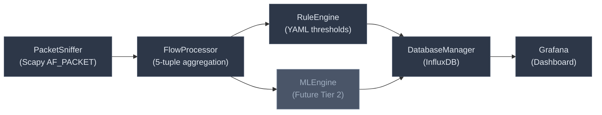
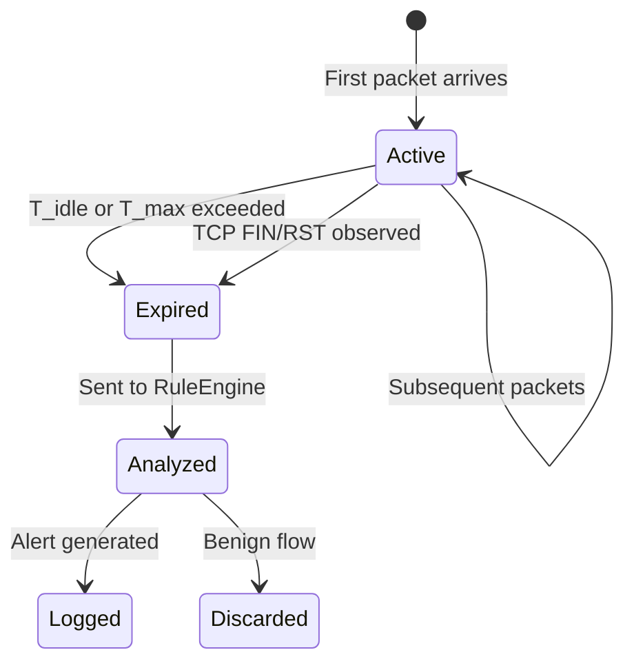

# Architecture

Detailed technical architecture of Tepegoz IDS, extracted from the [System Design Description](../documents/md/SDD-v1.md).

---

## System Overview

Tepegoz IDS is a modular network security solution designed to run on consumer-grade hardware. It operates through a four-stage data processing pipeline:



> The MLEngine (Tier 2) is a future component — the architecture supports it, but the current release uses rule-based detection only.

---

## Component Descriptions

### PacketSniffer (`core/capture.py`)

The system's interface with the physical network.

- Wraps Scapy's `sniff()` function to capture packets in promiscuous mode
- Applies BPF (Berkeley Packet Filter) kernel-level filters to drop irrelevant traffic before it reaches userspace
- Passes only IP/TCP/UDP/ICMP headers to the FlowProcessor — payloads are discarded immediately (`store=False`)
- Runs in a dedicated thread to avoid blocking the main processing loop

**Key attributes:**
| Attribute | Type | Description |
|-----------|------|-------------|
| `interface` | `str` | Network interface name (e.g., `eth0`) |
| `bpf_filter` | `str` | BPF filter expression for kernel-level filtering |

### FlowProcessor (`core/flow.py`)

Manages the state of active network connections and computes statistical features for Encrypted Traffic Analysis (ETA).

- Maintains an in-memory hash map of active flows keyed by 5-tuple: `(src_ip, dst_ip, src_port, dst_port, protocol)`
- Computes real-time metrics: packet count, byte count, duration, packets per second, SYN/ACK flag counts
- Implements flow timeout mechanisms:
  - **Idle timeout** (`T_idle`): Flow finalized after no packets for 15s
  - **Max duration** (`T_max`): Flow finalized after 600s regardless of activity
  - **TCP FIN/RST**: Immediate finalization on connection teardown
- Thread-safe via `threading.Lock` synchronization

**Flow lifecycle:**



### RuleEngine (`core/rules.py`)

The deterministic core of the system. Evaluates flow statistics against configurable threshold rules.

- Loads rules from external YAML configuration — no code changes needed to add/modify rules
- Supports 6 comparison operators: `eq`, `neq`, `gt`, `gte`, `lt`, `lte`
- Supports `all` (AND) and `any` (OR) logic for combining conditions
- Per-rule cooldown timers to prevent alert flooding

**Cross-flow correlation via SourceTracker:**

The `SourceTracker` class aggregates per-source-IP statistics across all micro-flows within a sliding time window. This is critical because many attacks (SYN floods, port scans) spread across hundreds of micro-flows that individually look benign.

Tracked cross-flow metrics:
| Metric | Description |
|--------|-------------|
| `cross_flow_count` | Total active flows from this source IP |
| `cross_pps` | Aggregate packets per second across all flows |
| `cross_bps` | Aggregate bytes per second across all flows |
| `cross_unique_dst_ports` | Number of unique destination ports targeted |
| `cross_syn_ratio` | Ratio of SYN packets to total packets |

### DatabaseManager (`core/database.py`)

Handles all I/O operations with InfluxDB.

- Uses separate write APIs for **batched** (metrics) and **immediate** (alerts) writes
- Batched writes amortize HTTP overhead for high-frequency metric points
- Alert writes are immediate to minimize detection-to-display latency
- Async error logging for failed writes

### Summary Engine (`core/summary.py`)

Computes periodic rollup statistics for dashboard visualization:
- **Traffic rollup**: bytes/sec, packets/sec, flow count by protocol and direction
- **Top hosts**: Most active IPs by packet count, byte count, flow count
- **Top services**: Most active port/protocol combinations

---

## Data Design

### Transient vs. Persistent Data

| Data Type | Storage | Lifetime | Description |
|-----------|---------|----------|-------------|
| Raw packets | RAM only | Milliseconds | Discarded after header parsing |
| Active flows | RAM (hash map) | Seconds to minutes | In-memory until finalized |
| Flow metrics | InfluxDB | Configurable retention | Persisted for dashboard queries |
| Alerts | InfluxDB | Configurable retention | Persisted for alert history |

### InfluxDB Schema

**Measurement: `traffic_rollup`**
| Type | Name | Description |
|------|------|-------------|
| Tag | `protocol` | TCP, UDP, ICMP |
| Tag | `direction` | inbound, outbound |
| Field | `bytes_per_second` | Throughput rate |
| Field | `packets_per_second` | Packet rate |
| Field | `flow_count` | Active flow count |
| Field | `byte_count` | Total bytes in window |

**Measurement: `alerts`**
| Type | Name | Description |
|------|------|-------------|
| Tag | `rule_name` | Name of triggered rule |
| Tag | `severity` | Critical, High, Medium, Low |
| Tag | `direction` | inbound, outbound |
| Field | `src_ip` | Source IP address |
| Field | `dst_ip` | Destination IP address |
| Field | `description` | Human-readable alert message |

---

## Mathematical Model

### Inter-Arrival Time (IAT)

Measures the time gap between consecutive packets. Critical for distinguishing human traffic (irregular IAT) from automated attacks (regular/zero IAT).

```
IAT_k = t_k - t_{k-1}
μ_IAT = (1/(n-1)) × Σ IAT_k
```

If `μ_IAT ≈ 0`, it indicates a flooding attack.

### Flow Throughput

```
Byte Rate  = total_bytes / flow_duration
Packet Rate = total_packets / flow_duration
```

A sudden spike in packet rate combined with small packet sizes typically indicates a DoS attempt.

### TCP Flag Ratios

```
SYN Ratio = SYN_count / total_packets
```

In a normal TCP handshake, `SYN Ratio` is very low (1-2 SYN packets per flow). If `SYN Ratio > 0.8` (80%+ packets are SYN), it's flagged as a SYN Flood.

---

## Design Rationale

### Why Flow-Based Analysis (ETA)?

Modern traffic is increasingly encrypted (HTTPS/TLS). Traditional Deep Packet Inspection (DPI) is blind to encrypted payloads and computationally expensive.

- **Privacy**: Flow analysis respects user privacy — only metadata is analyzed
- **Visibility**: Attacks like DoS floods and port scans are clearly visible in traffic metadata regardless of encryption
- **Performance**: No need to reconstruct TCP streams or parse application-layer protocols

### Why Python & Scapy?

- **Rapid development** with extensive libraries for network programming
- **Scapy** provides unmatched flexibility for parsing headers
- **Trade-off**: Slower than C-based sniffers, but sufficient for SOHO networks (≤100 Mbps)
- **BPF filters** compensate by dropping irrelevant traffic at the kernel level

### Why InfluxDB & Grafana?

- Network data is inherently **time-series data** — relational databases struggle with write-heavy workloads
- InfluxDB is optimized for exactly this use case
- Grafana provides a **production-ready frontend** without custom web development
- Both are open-source and widely adopted

### Why Native `.deb` Instead of Docker?

- The sensor requires direct NIC access (promiscuous mode, `CAP_NET_RAW`)
- Docker adds network namespace complexity and potential packet loss
- `systemd` provides process supervision, auto-restart, and journal logging out of the box
- Docker Compose remains available for development and replay testing

---

## Deployment Topology

```
┌─────────────────────────────────────────────┐
│              Linux Host / VM                │
│                                             │
│  ┌────────────────────────────────────────┐ │
│  │  tepegoz-ids.service (systemd)         │ │
│  │  ┌──────────┐ ┌──────┐ ┌────────────┐ │ │
│  │  │ Sniffer  │→│ Flow │→│ RuleEngine │ │ │
│  │  │ (eth0)   │ │ Proc │ │ (rules.yml)│ │ │
│  │  └──────────┘ └──────┘ └─────┬──────┘ │ │
│  └──────────────────────────────┼────────┘ │
│                                 ▼           │
│  ┌──────────────┐    ┌──────────────────┐  │
│  │ InfluxDB     │◀───│ DatabaseManager  │  │
│  │ (port 8086)  │    └──────────────────┘  │
│  └──────┬───────┘                          │
│         ▼                                  │
│  ┌──────────────┐                          │
│  │ Grafana      │  ← http://localhost:3000 │
│  │ (port 3000)  │                          │
│  └──────────────┘                          │
└─────────────────────────────────────────────┘
```

- **Sensor runtime**: Native Linux service managed by systemd
- **Companion services**: InfluxDB and Grafana installed and managed via `tepegoz dash setup`
- **Development/testing**: Docker Compose available for replay harnesses and dashboard validation
